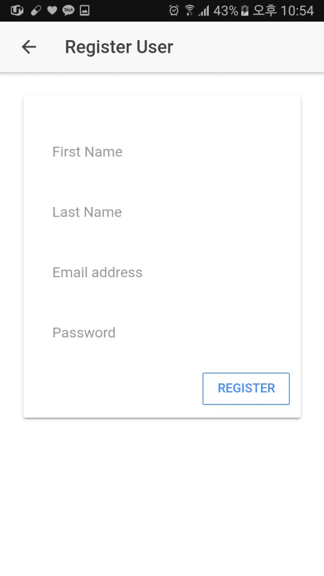
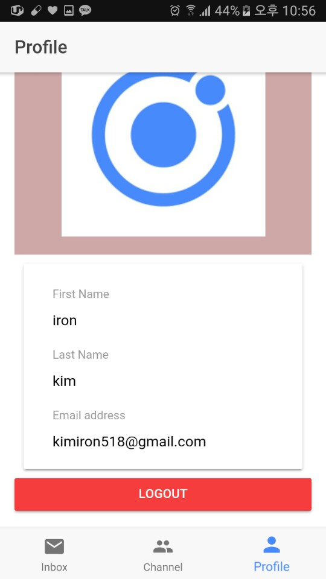
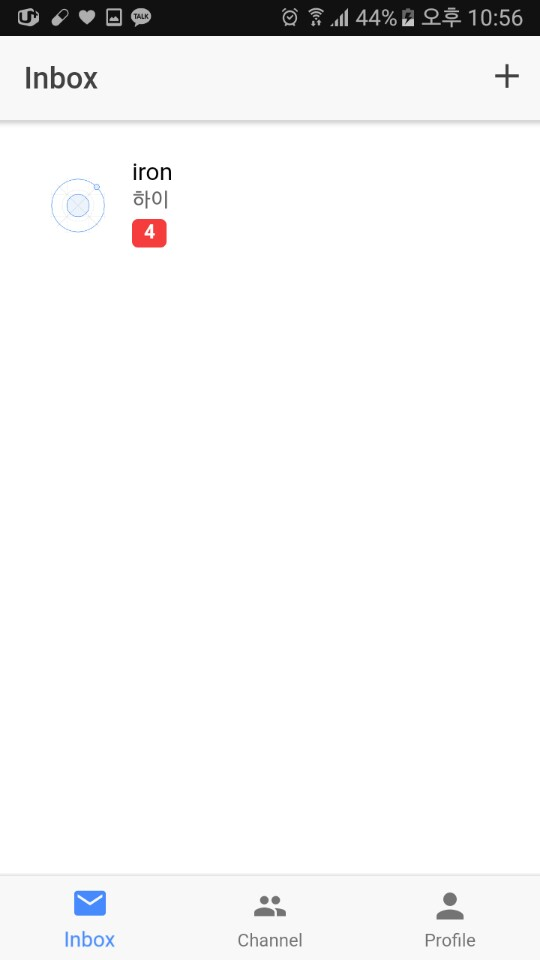
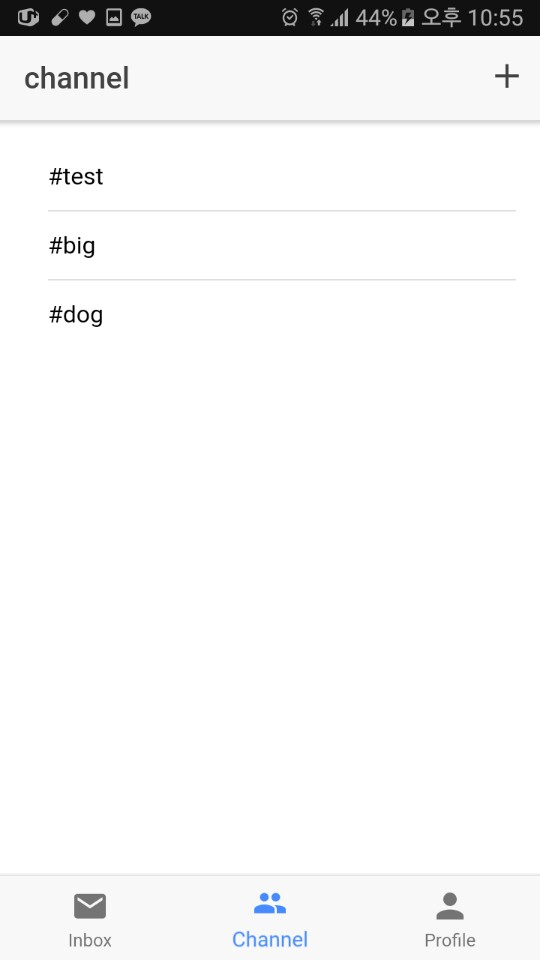
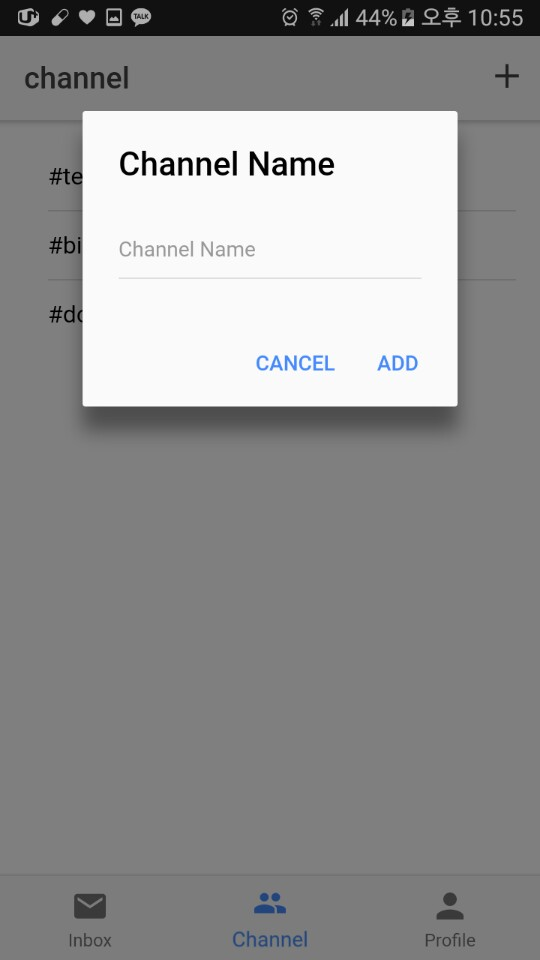
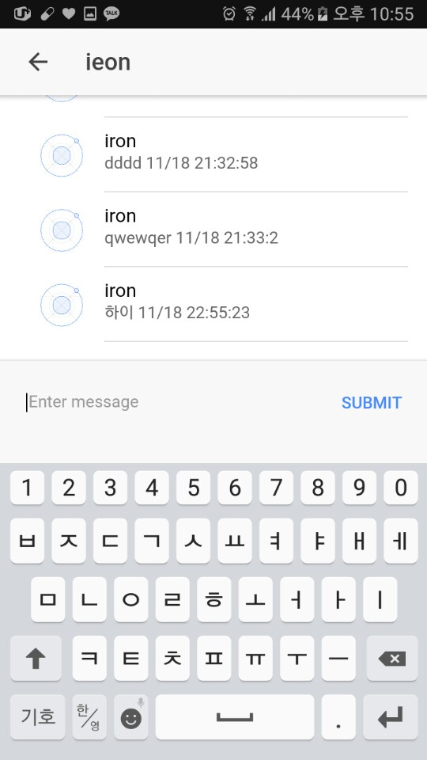
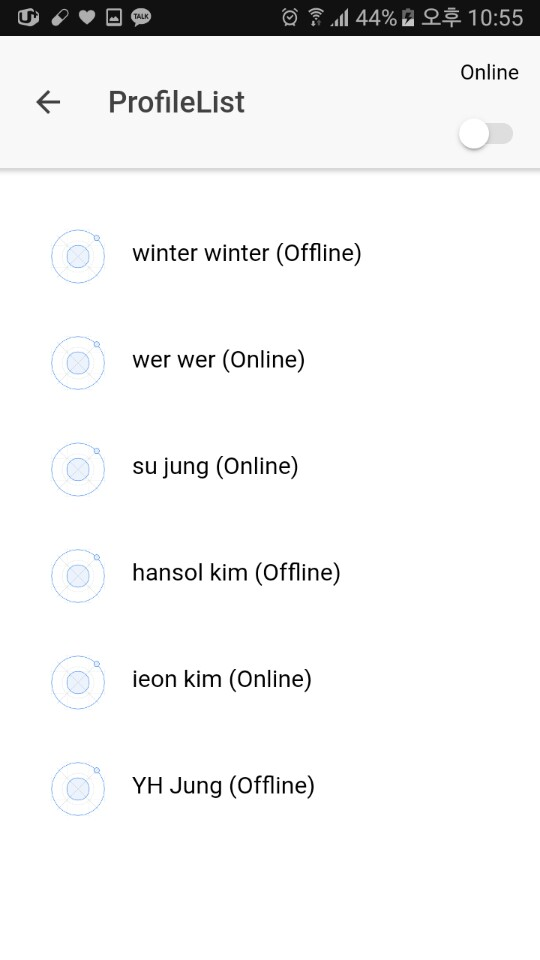

# ionicChat

## How to use

You install pakage.json


```
npm install
```


And execute


```
ionic serve
```

## Example
### register

### login

### profile

### inbox

### channel

### creating channel

### chat

### friend list online & offline


