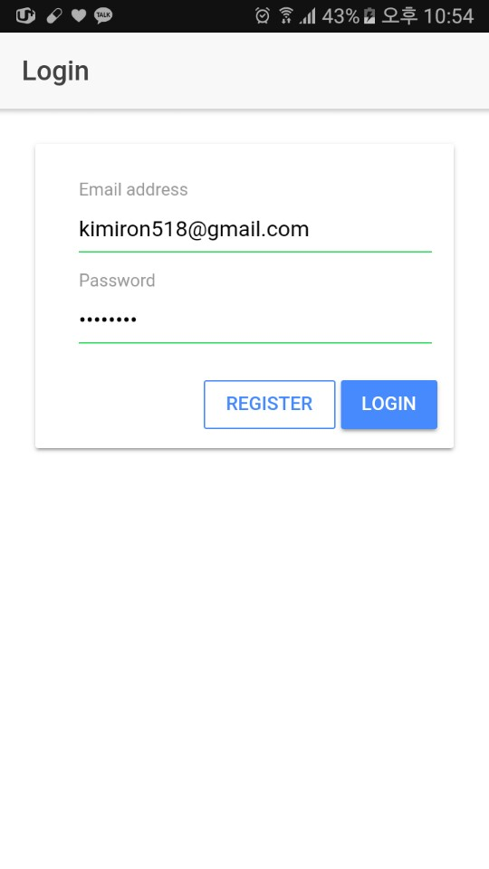

# ionicChat

## How to use

You install pakage.json


```
npm install
```


And execute


```
ionic serve
```

## Example
### register


### login


### profile


### inbox


### channel


### creating channel


### chat


### friend list online & offline


